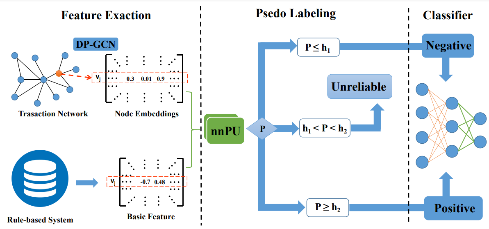

```
file: readme.md
author: PiggyGaGa
email: liana_gyd@163.com
```

## source code for FBNE-PU
This is a repository contains an example implementation of FBNE-PU algorithm, we provide not only our proposed algorithm in this repository, but also the baselines we used in our paper.

## Code structure
As describe in the paper, the FBNE-PU is a multi-stage algorithm which contains Feature extraction stage, PU pseudo labeling stage and final MLP classification stage. In this repository, we have 3 subfolders: `Baselines`, `Classification` and `Analyze`. `Baselines` deposits the network embedding algorithms related code files. `Classification` deposits the PU pseudo labeling and MLP classification code files. `Analyze` deposits some analysis code in our paper, such as  preprocess analysis of transaction network, sensitivity analysis, visualization. You can refer the following table.

| folder         | Function                                                  |
|----------------|-----------------------------------------------------------|
| Baselines      | Network embedding algorithms' source code and training code |
| Classification | nnPU pseudo labeling and MLP classification code            |
| Analyze        | Some analysis tools of FBNE-PU                                  |

## Explaination

FBNE-PU provide a novel framework for tax evasion detection as a multi-stage algorithm, which emphasizes the application in practival tax evasion detection. For an illustration,



This home repository contains the implementation for three tax dataset, the organize our code as similar with the framework of FBNE-PU, including network embedding implementation PnCGCN and other baselines, nnPU pseudo labeling and MLP classification. Finally some analysis tools are provided in this repository.


## Dependencies

Our implementation works with PyTorch>=1.0.0 Install other dependencies: `$ pip install -r requirement.txt`

